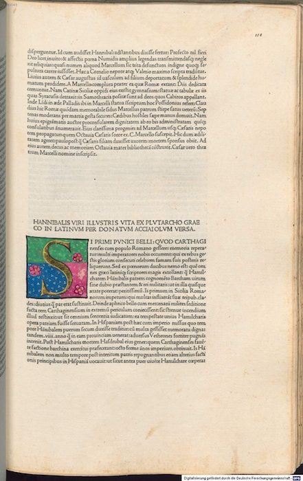
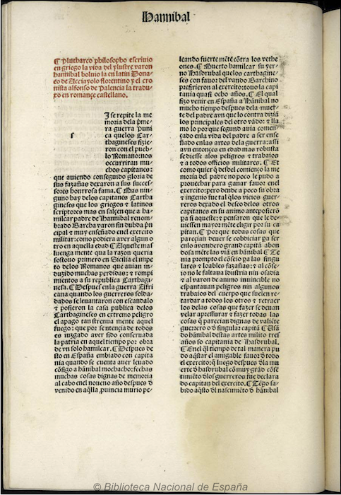

The manuscript sources are being pulled from <https://github.com/susannalles/Vitae>, and published in <https://github.com/susannalles/susannalles.github.io/tree/master/Vitae> 

We transform the transcription in XML-TEI, into markdown files. Afterwards, the site is build dynamically using Markdown, YAML, HTML Templates and CSS. 

[Vitae Hannibalis - Vita de Scipión](VH/VH-1.html)

