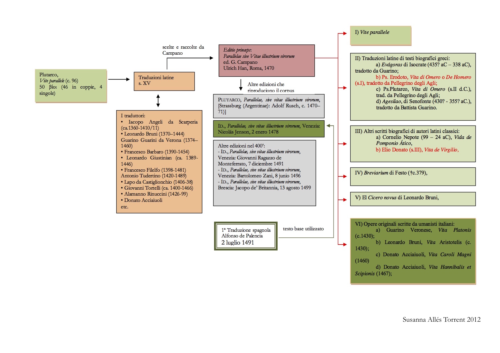
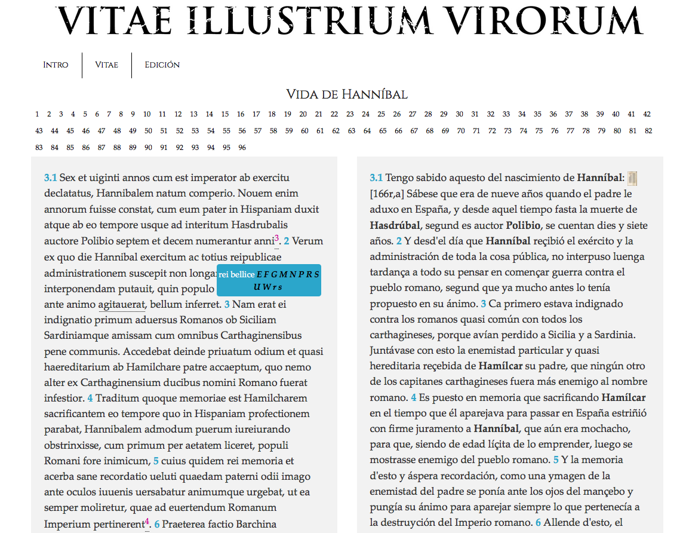
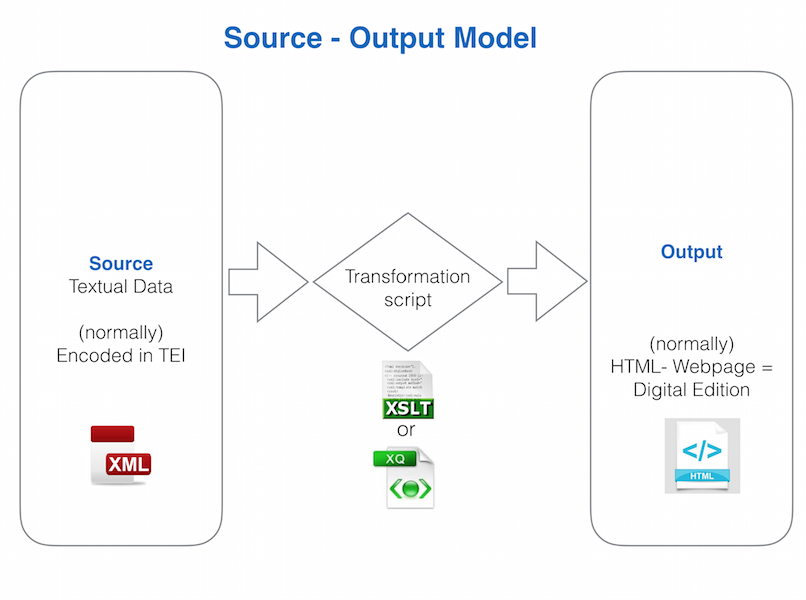
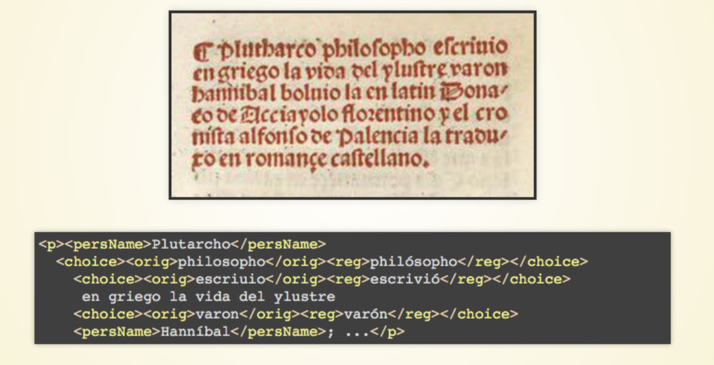

### Sobre el Proyecto *Vitae Illustrium Virorum*

<ul class="button-group">
<li><a href="#contexto-de-la-obra" class="tiny button">1. Contexto de la obra</a></li>
<li><a href="#funcionalidades-de-la-edicin-digital" class="tiny button">2. Funcionalidades</a></li>
<li><a href="#implementacin-tcnica" class="tiny button">3. Implementación técnica</a></li>
</ul>

#### 1. Contexto de la obra

A lo largo del siglo XV diversos humanistas italianos tradujeron de manera espontánea las *Vidas Paralelas* de Plutarco. Entre los traductores se encontraban humanistas italianos de la talla de Iacopo Angeli da Scarperia, Leonardo Bruni, Guarino Veronese, Leonardo Barbaro o Francesco Filelfo. 

Unos años más tarde, en 1470, Giovannantonio Campano, bajo el título [*Parallelae sive Vitae Illustrium Virorum*](http://istc.bl.uk/search/search.html?operation=record&rsid=500536&q=0) y en los talleres de Ulrich Han, seleccionó las traducciones existentes y publicó en su integridad las biografías del autor de Queronea. La originalidad principal de esta edición, que configuraría la base para las posteriores reediciones del corpus latino plutarqueo, fue la inclusión de otras biografías de autores diferentes tanto antiguos como modernos.  Así, entre las biografías pseudoplutarqueas encontramos: 

1. Traducciones latinas de textos biográficos griegos:
	+ *Evágoras* de Isócrates (435? a.C – 338 a.C), traducido por Guarino 
	+ Ps. Heródoto, *Vida de Homero* o *De Homero* (s. I), traducido por el florentino Pellegrino degli Agli
	+ *Agesilao* de Jenofonte (430? - 355? a.C.), traducido por Battista Guarino.

2. Otros escritos biográficos de autores latinos clásicos:
	+ *Vida de Pomponio Ático* de Cornelio Nepote (99 – 24 a.C)
	+ *Vida de Virgilio* de Elio Donato (s. III)
		
3. *Breviario de la Historia Romana de Festo* (†ca. 379)
	
4. El *Cicero novus* de Leonardo Bruni, un híbrido entre la traducción de la biografía plutarquea homónima y la reelaboración libre.
	
5. Un grupo de obras originales escritas por humanistas a imitación de las *Vidas de Plutarco*:
	+ Guarino Veronese, *Vita Platonis* (ca. 1430)
	+ Leonardo Bruni, *Vita Aristotelis* (ca. 1430)
	+ Donato Acciaiuoli, *Vita Carolimagni* (1460)
	+ Donato Acciaiuoli, *Vita Hannibalis et Scipionis* (1467)

Una [segunda edición](http://istc.bl.uk/search/search.html?operation=record&rsid=500610&q=2), que calcaba la anterior, se imprimió en Estrasburgo un año más tarde. Pero la edición que reviste mayor interés para nuestro caso fue [la tercera](http://istc.bl.uk/search/search.html?operation=record&rsid=500610&q=3), del año 1478, publicada en Venecia por Nicolás Jenson. Esta fue la utilizada por Palencia para llevar a cabo su traducción. Jenson enmendó errores, introdujo algunos cambios en las traducciones, substituyendo las de un traductor por otro, introduciendo algunos cambios en el orden de aparición de las biografías y eliminando otros trabajos como la *Vida de Virgilio* de Elio Donato. 

Este corpus pasó a diversas lenguas romances, como el francés, el italiano, y el castellano. A esta última lengua vertió el cronista Alfonso de Palencia la edición veneciana de las *Vidas paralelas*,  llevando a cabo una traducción en bloque, sin detenerse a elucidar la autenticidad de ciertas biografías y no percatándose que, en muchas ocasiones, las biografías no eran auténticas de Plutarco, como en el caso de las Vidas de Aníbal y Escipión o la de Cicerón; esta última substituida en el corpus por el trabajo original de Leonardo Bruni. La traducción de las *Vidas paralelas* realizada por Palencia vio la luz el 2 de julio de 1491 en Sevilla y fue impresa en los talleres de los «Cuatro compañeros alemanes» con el título de *Las Vidas de Plutarco*, según se indica en su colofón.

La traducción de Alfonso de Palencia es una aportación muy significativa al legado cultural hispánico del siglo XV y a los estudios de recepción clásica e italiana. El presente proyecto aspira a recoger esta serie de biografías pseudoplutarqueas y a ofrecer, por primera vez, una edición digital. 

#### 2. Funcionalidades de la edición digital

La edición digital, que todavía se halla en un estado embrionario, prevé ofrecer las siguientes funcionalidades:

* Texto bilingues: versión en latín y traducción paralela en castellano 
* Imágenes de las ediciones antiguas accesibles a través de los números de folio o del icono correspondiente. 
* 'Aparato crítico' que recoja las variantes respecto a la edición latina del 1478, y que señale las correcciones realizadas en el texto castellano. Como solución provisional se adopta un sistema de ventanas emergentes. 
* Notas a pie de página en ambos textos, en forma de ventana emergente. En el caso del texto latino corresponden en su mayoría a referencias de fuentes literarias o históricas utilizadas por los autores italianos; en el caso del texto castellano, las notas abordan cuestiones relativas al método de traducción.  
* Lista de nombre de personajes
* Lista de nombres de lugar
* Mapa con los lugares mencionados 
* Glosarios elaborados a partir de los corpora en latín y en castellano
* Acceso a los textos en formatos diversos: [XML-TEI](https://github.com/susannalles/Vitae/tree/master/public/XML-TEI), [texto plano](https://github.com/susannalles/Vitae/tree/master/public/XML-TEI/TXT), pdf 
* Infraestructura digital en acceso abierto para que pueda ser reutilizada y personalizada para otros proyectos similares.

#### 3. Implementación técnica

<ul class="button-group">
<li><a href="#filosofa-digital" class="tiny button">3.1. Filosofía digital</a></li>
<li><a href="#modelo-de-edicin-digital-source---output" class="tiny button">3.2. Modelo de edición</a></li>
<li><a href="#tipo-de-marcado-extensible-markup-language---text-encoding-initiative" class="tiny button">3.3. Tipo de marcado</a></li>
<li><a href="#infraestructura-digital-y-mtodo-de-publicacin" class="tiny button">3.4. Infraestructura</a></li>
</ul>

##### 1. Filosofía digital 

Como iniciativa digital, este proyecto va en sintonía con algunos de los principios propuestos por las [Humanidades Digitales](http://tcp.hypotheses.org/487) y, especialmente, con los principios establecidos por el grupo [Minimal Computing](http://go-dh.github.io/mincomp/). En concreto, se apuesta por: 

* Tecnologías mínimas y de bajo coste, y estándares web 
* Escalabilidad (proyecto en crecimiento)   
* Reuso y reproducibilidad  
* Colaboración
* Open source y acceso abierto
* Preservación a largo término

Este proyecto procede esencialmente del trabajo realizado en la tesis doctoral de S. Allés Torrent,[*Parallelae sive Vitae Illustrium Virorum (Las Vidas de Plutarco, Sevilla, 1491). Estudio y edición crítica de la traducción de alfonso de Palencia de las vidas compuestas por Donato Acciaiuoli, Leonardo Bruni y Guarino Veronés*](http://diposit.ub.edu/dspace/handle/2445/41677?mode=full), Universitat de Barcelona 2012. Las [primeras directrices](vitae_en.html) del proyecto digital se redactaron en el seno del Columbia Group for Experimental Methods in the Humanities [xpmethod](http://xpmethod.plaintext.in/) de la Universidad de Columbia.

##### 2. Modelo de Edición digital Source - Output 

El modelo escogido para llevar a cabo nuestra edición es el que 'Source-Output model' consistente en mantener diferenciados en todo momento los materiales textuales y la presentación final.  En este modelo se requiere por lo general que el editor filológico sea el mismo que codifica el texto. En el esquema vemos cómo, por un lado, existe una fuente primaria que contiene los datos textuales, normalmente codificados en XML-TEI, y, por otro, una transformación independiente que crea un nuevo resultado, normalmente una página web en HTML, sin modificar los ficheros fuentes.  

Este tipo de modelo es el que utilizan las edición paradigmáticas, nomenclatura propuesta por Elena Pierazzo ([Pierazzo 2014](http://scholarlyediting.org/2014/essays/essay.pierazzo.html)), donde incluyen las ediciones diplomáticas (basadas en un solo manuscrito) y las ediciones críticas digitales (basadas en más de uno). 

Los colaboradores pueden así trabajar, especialmente en un primer momento, con texto plano o markdown, y aplicar el escenario de transformación de sus textos para visualizarlos en HTML o bajo forma de página web. 

##### 3. Tipo de marcado: eXtensible Markup Language - Text Encoding Initiative 

Los ficheros fuentes son marcados en XML y según las directrices de la Text Encoding Initiative, la propuesta más sólida en humanidades y ciencias sociales para transformar textos en datos informáticos y añadirles toda clase de información para procesarla electrónicamente. 

En el caso de esta edición, es gracias a la codificación en XML-TEI que podremos marcar todos los aspectos que consideremos necesarios: abreviaturas, correcciones, notas de diversa índole, etc. El marcado sirve, en definitiva, para hacer explícito una serie de fenómenos que de otra manera el ordenador no sabría identificar. 

Por ejemplo, en esta imagen vemos cómo la marca 'persName' nos ayudará a recuperar todos los nombres de persona y crear, por ejemplo, un índice de personas, o añadir cierta información a los personajes cuando nos topemos con estos. Las marcas que señalan lecturas diferentes, como las formas regularizadas, nos permitirán ofrecer diferentes versiones de lectura: una diplomática o paleográfica y fiel al original, y otra normalizada. Incluso, en este otro ejemplo donde recopilamos la información de los diferentes testimonios podremos reconstruir el manuscrito que nos interese más. 

Más informaciones sobre la Text Encoding Initiative en [S. Allés Torrent, Introducción a la edición digital de textos: TEI-XML](http://susannalles.github.io/Web-TEI/1.1.html)

##### 4. Infraestructura digital y método de publicación

El punto de partida de la edición son ficheros en texto plano, que posteriormente son codificados en XML-TEI, albergados gratuitamente y en abierto en GitHub. La carpeta que contiene los ficheros XML forman parte de una infrastructura web creada con [Jekyll](https://jekyllrb.com/) que es un generador de sitios web estáticos. Este generador es el encargado de recoger y transformar los documentos XML en simples páginas HTML según el tipo de plantilla (layout) al que van asociadas. Las plantillas o layouts, creados a partir del framework [Foundation](http://foundation.zurb.com/), son los modelos de páginas que queremos aplicar a nuestro proyecto, así hay una para las partes generales y una para las ediciones.  

Toda la infraestructura web vive también en el repositorio [GitHub](https://github.com/susannalles/Vitae). 

El resultado de todo esto es un sitio web estático simple que puede ser actualizado constantemente desde los ficheros fuente que contienen el texto editado de Palencia y integrado en el sitio; además se puede de manera paralela seguir experimentando en la presentación y el resultado final a medida que nuevas necesidades van surgiendo. 

En fin, como método de publicación web se opta de momento por una publicación gratuita y en abierto albergada por la misma plataforma GitHub, gracias al sistema de [GitHub Pages](https://pages.github.com/).  En definitiva, GitHub sirve como repositorio de todo el trabajo individual y colaborativo, Jekyll como infraestructura web, y GitHub Pages como método de publicación.

